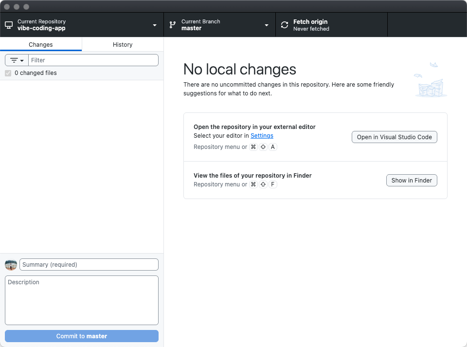

# AI 应用开发导论与学习环境配置

使用 Trae 安装 [vibe-coding-app](https://gitlink.org.cn/ai-shifu/vibe-coding-app) 的开发环境，项目代码运行结果见下图。安装过程比较简单，使用 Trae 命令行工具即可完成 python 虚拟环境和 Node.js 的安装，同时推荐使用 Github Desktop 进行版本控制，操作简单。

课程材料 [借助Vibe Coding 开发 AI 应用](https://app.ai-shifu.cn/c/51ee98a2341940b3a96774b5cb9559cb)，第一次阅读这类交互式的教程，很惊喜，有时在想将这种交互式教学的方式带到中学课堂，有没有什么益处，后续有时间可以尝试一下。

教程中，直接教我如何使用 coze 来生成我的目标应用（跑步助手）。coze 上手很快，几乎零学习成本，几分钟内就能看到效果，且跑步助手为我制定的训练计划初步看下来也很合理。

