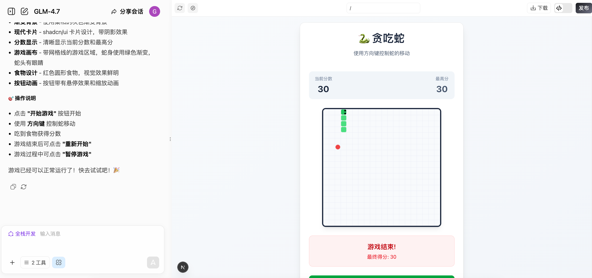
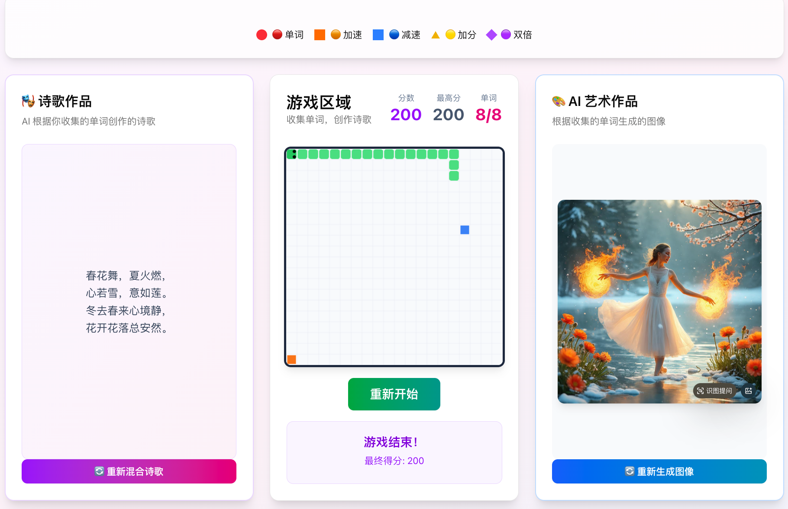
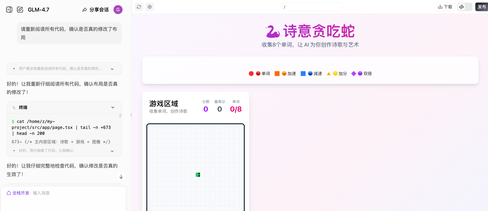

# AI时代，会说话就会编程

通过本节，学习如何使用 Vibe Coding 创建一个 AI 应用。了解到一个关键信息，小项目的网页交互demo 可以通过 Vibe Coding 平台在简单的多轮对话中创建。而对于大型项目，如开发一个全新的软件或复杂系统，需要梳理出清晰的整体流程，对项目进行拆分，将其分解为多个独立模块，再借助 ai 辅助开发。

### 贪吃蛇游戏
借助 [z.ai](https://chat.z.ai/) 平台，用课程提示词生成贪吃蛇游戏原型。在该基础上，让 ai 添加两个小功能：
- 添加多个不同的道具，吃到道具后蛇的移动速度加快或变慢等；
- 撞墙后，判断单词数量是否满足要求，满足要求则生成诗歌和图片；

游戏网址：https://e1z0bew3t8j1-d.space.z.ai

在平台渲染时，布局有问题，游戏区域一直放在左边，让 ai 修改后依然如此，但发布后布局回复正常。

### 跑步助手
