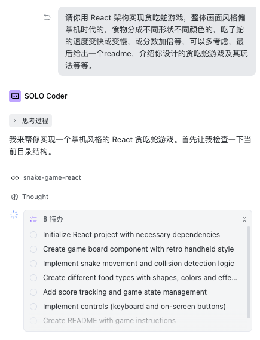
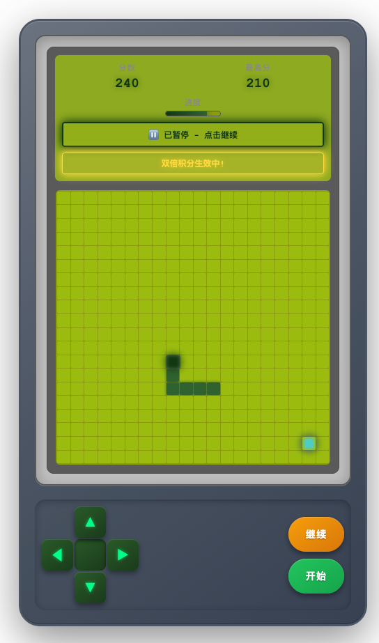
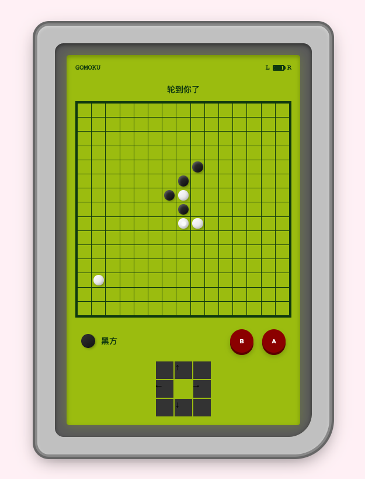

# 认识AI IDE工具

在本节课程，主要使用 Trae solo 模式进行开发，使用下来发现，似乎 solo 模式和常规 builder 模式区别不是很大，每一轮都需要确认是否要保留代码。

### 贪吃蛇游戏

在 solo 模式下，使用 GLM-4.7 模型，生成的代码放在 `code/snake-game-react`。
```
请你用 React 架构实现贪吃蛇游戏，整体画面风格偏掌机时代的，食物分成不同形状不同颜色的，吃了蛇的速度变快或变慢，或分数加倍等，可以多考虑，最后给出一个readme，介绍你设计的贪吃蛇游戏及其玩法等等。
```




### 五子棋

使用 MiniMax-M2.1 模型来实现五子棋游戏

```
实现一款在线的五子棋小游戏，风格偏掌机时代。
```


